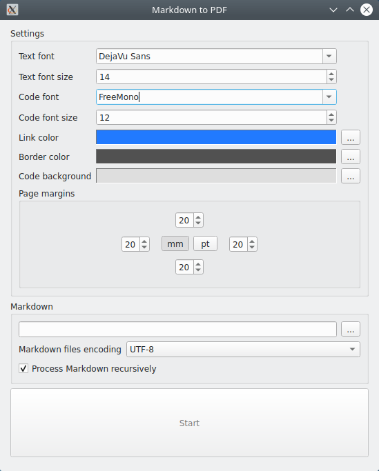

# About

Converter of Markdown to PDF.

Why another Markdown to PDF converter?
Because I want to feed root Markdown file to the application and get
complete PDF with all subpages that linked in root file. I tried to find
such ready tool, but my search was unsuccessful.

As Markdown is not very strickt there are possible variations on rendering
of your files. If you will see that this application renders something wrong
(possible issue) you are welcome to fill the issue here on GitHub.
Please send me part of wrong rendered Markdown, what you got (PDF),
and what you expected to see (link to something that rendered right in
your opinion).

# Status

Alpha version is ready. Surely, there possible issues in the application.
But we don't afraid of bugs. Just post the issue here, and I will fix it
as soon as possible.

The application is tested on Mac OS, Linux, Windows 10.

# License

GNU GPL version 3

# Building

To build this application first of all install dependencies of PoDoFo

* freetype
* libjpeg
* zlib

On UNIX you also need

* fontconfig

With these dependencies installed just open CMakeLists.txt in QtCreator and run build.

# Fonts

If you will have problems with characters in PDF on your system, try to choose another
font. Not all fonts are supported that supported by Qt, not all fonts have full list
of Unicode characters needed by your Markdown. Just play with fonts comboboxes in the GUI.

# Screenshot

